# Javascript .some() method

The `some()` method in Javascript is used to determine if there exists at least one element in the array (or array-like object) that satisfies a given condition by a provided callback function. If such an element exists, the method stops immeditately and returns true.  If such an element does not exist, the method will return false upon completion.

## Key details of the `some()` method

The `some()` method is one of the many iterative methods of the Javascript Array class.  That is, the `some()` method takes a callback function and applies it to each element in an array in consecutive order. The return value of the callback function is what determines the outcome of `some()` method, either `true` or `false`.  The `some()` method does not directly change (mutate) the element values of the array that is used with it.  However, the callback function can do so.

The syntax for the `some()` method is as follows:

*Figure 1: Syntax of the Javascript `some()` method*

| Method part | Description                                                            |
| ----------- | ---------------------------------------------------------------------- |
| `myArray`   | The array whose elements are being tested by the callback function.    |
| `.some()`   | The method used to apply the callback function to the `myArray` array. |
| `callbackFunction` | The function that is tested on each element of `myArray`. It should return `true` if an element passes the `callbackFunction` test, `false` otherwise. |
| `element`   | The current element, or value, in `myArray` being tested. |
| `index`     | *(optional)* The position that the current element is located in `myArray`. |
| `array`     | *(optional)* The array that the `some()` method owas used on (in this case, `myArray`).|
| `thisArg`   | *(optional)* Used as the `this` value when calling the `callbackFunction`. Defaults to undefined when not used. |

*Table 1: Breakdown of the parts used in the execution of the .some() method. Parts are required unless noted as optional.*

## What does the `some()` method return?

The `some()` method should return true at the first instance an element meets the conditions of the `callbackFunction`, regardless of where in the array that element is indexed.   For example, if the first element in an array of 100 elements meets the condition of its `callbackFunction`, the `some()` method stops checking and immediately returns a value of true. It will not need to check the rest of the array because the condition has been satisfied.

*Figure 2: The `some()` method returning a value of true the moment an element meets the condition of the `callbackFunction`.*

If, however, every element in an array is checked and none of them pass the condition of the `callbackFunction`, the `some()` method will return false.

*Figure 3: The `some()` method returning a value of false after all elements have failed the condition of the `callbackFunction`.*

## Applications

### Callback functions

Just like other Javascript Array methods, the `some()` method can use both named and anonymous functions as an argument.  This is because functions are considered [first-class objects](https://developer.mozilla.org/en-US/docs/Glossary/First-class_Function).

#### Using a named function as a callback

You can apply a named function as an argument to the `some()` method.  In the example below, the function named `isEqualToFive` is applied as the callback function argument to the `testArray1.some()` call.

*Figure 4: Testing an array using the `some()` method with a named callback function.*

#### Using an anonymous function as a callback

Anonymous functions can be used in lieu of named function. This is useful if the function is used as an argument only once.  Here, an anonymous callback function is used to determine if `testArray2` has an element that is of type `string`.

*Figure 5: Testing an array using the `some()` method with an anonymous function as a callback function.*

#### Using an anonymous arrow function as a callback

Arrow functions can also be used as an argument to the `some()` method. Here we apply the same condition to `testArray2` as above, except an arrow function is used as a callback function.

*Figure 6: Testing an array using the `some()` method with an anonymous arrow function as a callback function.*

### Applying `some()` to sparse arrays

The `some()` method will not execute its callback function on empty indices in an array.  These are called sparse arrays. `some()` will not even treat them as undefined. For example, the array in Figure 7 is missing an element at index 1. The callback function tests to determine if there are any elements that are undefined.  Since index 1 is empty, `some()` will not test to determine if it is undefined:

*Figure 7: In sparse array elements, when the index is empty, the `some()` method will not treat it as undefined.*